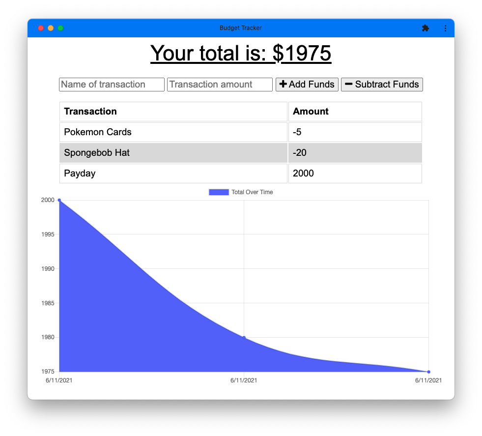

# Offline Capable Budget Tracker

## Table of Contents
- [Description](#description)
- [Installation](#installation)
- [Usage](#usage)
- [License](#license)
- [Questions](#questions)

## Description

This progressive web application allows the user to track a personal budget both online and offline. 

## Installation Instructions

Application can be accessed online [here](https://budget-tracker-mg.herokuapp.com/). 

## Usage

To start, Add Funds. Then use Subract Funds to input expenses. This application called also be installed using Add to Home Screen on iOS or Install on Chrome.  

## License 

This project is licensed under the MIT License. Click the link below to learn more about how you can use this project.  
License: [MIT License](https://opensource.org/licenses/MIT)

## Questions

* Github: [matthewxgoad](https://github.com/matthewxgoad)  
* Email: [matthewxgoad@gmail.com](mailto:matthewxgoad@gmail.com)
